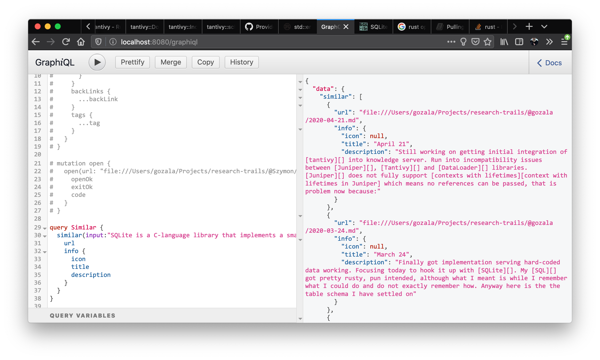

# April 21

Still working on getting initial integration of [tantivy][] into knowledge server. Run into incompatibility issues between [Juniper][], [Tantivy][] and [DataLoader][] libraries. [Juniper][] does not fully support [contexts with lifetimes][context with lifetimes in Juniper] which means no references can be passed, that is problem now because:

1. There be only one instance of [Tantivy][] service.
2. There needs to be a fresh [DataLoader][] for each received request on the server.

Which leads to situation that we need to create new context on each request, but we can't simply clone one (due to single instance requirement) nor we can use reference of service instead doe to [Juniper][]'s lack of support.

After failed attempts to figure out how to overcome [Juniper][] limitations I settled on wrapping service in [`std::sync::Arc`][].

---

Now that things are compiling I am facing with several open questions/issues:

1. Do we save content for every ingested resource ? Saving every single visited site content to disk does not seem like a great idea.
2. If we just save index we can not really surface anything beyond `url`, `title` and `description` of the resource when showing similar resources. Maybe that is reasonable.
3. If we just save index we can not really query for similar resource without providing content, in other words you could not query just via `url`.
4. [Tantivy][] does not seem to provide [SQLite like multi-process access][multi-processes access in SQLite] to the database, which is a significant drawback to consider. Furthermore it means that our scanner may corrupt database if server is running.

----

Looking into ways to delete existing documents from the [Tantivy][] index, so that multiple ingestions would not end up as duplicates.

Found example showing how to [delete/update document][delete/update document Tantivy], updating code base to replace resource from index during ingestion.

---

It is stupidly hard to reuse index with [Tantivy][], I could not believe there is no simple way to go about it. So I have created ticket asking for [`open_or_create(&path)` ][].

----

Got [initial implementation][inkandswitch/ksp#5] working

- `InputResource` input type used by `ingest(resource: InputResource!): Resource!` mutation has being added an optional `content: String` field. If provided content will be indexed and saved in association with a resource `url`. Search for similar resources will query that index. 
- scanner ingest all resources along with their contents, meaning they will be indexed. (Old data in the data base will have no index). ⚠️ Running scanner while server is running might corrupt index database
- new `similar(input: String!): [Resource!]!` endpoint was added to the `Query` which can be used to query index for similar resources.

[Tantivy]:https://crates.io/crates/tantivy "Full text search engine library written in Rust"

[Juniper]:https://graphql-rust.github.io/ "GraphQL server library for Rust"

[DataLoader]:https://crates.io/crates/dataloader "Rust implementation of Facebook's DataLoader"
[context with lifetimes in Juniper]:https://github.com/graphql-rust/juniper/issues/143 "Write docs for using Context with a lifetime"
[`std::sync::Arc`]:https://doc.rust-lang.org/std/sync/struct.Arc.html "A thread-safe reference-counting pointer"
[multi-processes access in SQLite]:https://ipfs.io/ipfs/QmdArtm46vP6foVYVMcY7Mat1thaneGWDh8qnKzArkGoZM/	"SQLite database can be accessed by multiple processes"
[delete/update document Tantivy]:https://github.com/tantivy-search/tantivy/blob/master/examples/deleting_updating_documents.rs "Deleting and updating documents in Tantivy"
[`open_or_create(&path)` ]:https://github.com/tantivy-search/tantivy/issues/817
[inkandswitch/ksp#5]:https://github.com/inkandswitch/ksp/pull/5

