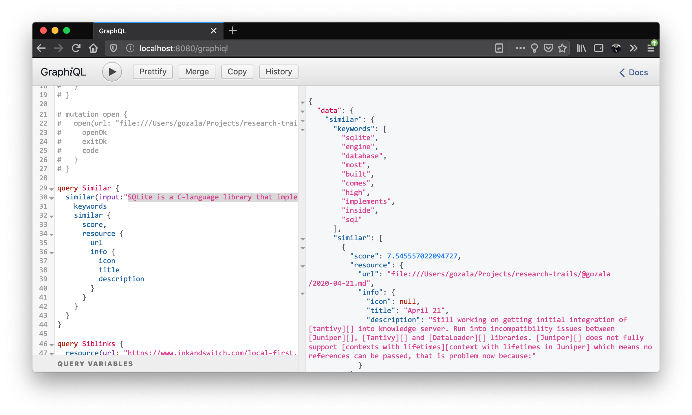

# April 22

After discussing questions with @pvh (yesterday) we have decided to do following:

- Save all the content (we can worry about problems later).
- Expose keywords & score of the matches in results.

Wrote a patch to expose keywords / score with results

As shown in the above screenshot keywords extracted are pretty naive ☹️, looking into this to see if there are opportunities to improve this.

[Tique][] provides a way to customize top terms picked as keywords through [`tique::topterms::KeywordAcceptor`][] based on following parameters

- Term frequency: How often has the given term appeared in the input.
- Document frequency: How many documents in the index contain this term.
- Index size: How many documents are in the index in total.

This seems useful, but appears to me that what we need to tweak is a tokenizer.

[Tique]:https://crates.io/crates/tique "Utilities to drive a tantivy search index"
[`tique::topterms::KeywordAcceptor`]:https://docs.rs/tique/0.4.0/tique/topterms/trait.KeywordAcceptor.html "Trait for tuning the algorithm to pick the top keywords"

