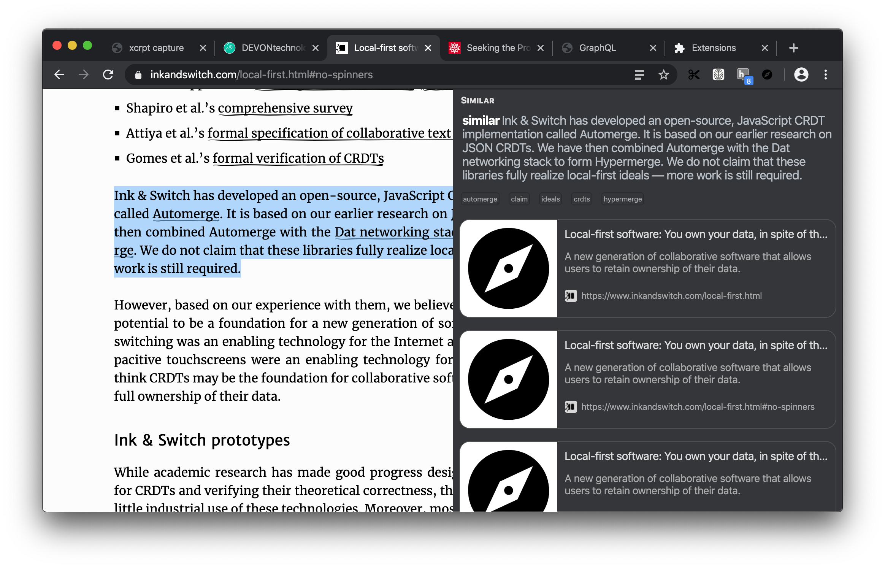

# April 23

Had a discussion with @pvh and turned notes into [ksp-browser][] issues and triaged existing issues.

As I was triaging noticed issue from @alexjg about [warning in Firefox][inkandswitch/ksp-browser/#24] and was excited to find out that add-on works in Firefox as is. Spend some time tweaking CSS to address some styling issues in Firefox [`627272a`][]

Made a change for [KSP browser][] that runs site content through a [readability][] to distill it to an actual content, then runs that through [turndown][] to turn it into markdown and finally submits that for ingestion to [KSP server][] which stores all into an index that can be queried for similarities.

Worked on surfacing similar resources based on text selections _([inkandswitch/ksp-browser#27][])_, and got initial version working:

However (perhaps) unsurprisingly best matches are the page itself. Need to change query API to include `sourceURL` so that it could be left out of returned results. Also as it can be seen on the screenshot above it seems we return same result multiple times because hash of the URL is different. Content based addressing might be a proper solution, but to keep things simple we can just start by omitting hashes ([inkandswitch/ksp-browser#32][]).

[KSP browser]:https://github.com/inkandswitch/ksp-browser/ "Knowledge server protocol client browser extension"
[readability]:https://github.com/mozilla/readability "A standalone version of the readability library used for Firefox Reader View"
[turndown]:https://github.com/domchristie/turndown "An HTML to Markdown converter"
[ksp server]:https://github.com/inkandswitch/ksp/ "Reference implementation of Knowledge Server Protocol  (KSP)"
[inkandswitch/ksp-browser/#24]:https://github.com/inkandswitch/ksp-browser/issues/24
[`627272a`]:https://github.com/inkandswitch/ksp-browser/commit/627272a773f6274a911bf09b0040d256ca63173d
[inkandswitch/ksp-browser#27]:https://github.com/inkandswitch/ksp-browser/issues/27
[inkandswitch/ksp-browser#32]:https://github.com/inkandswitch/ksp-browser/issues/32