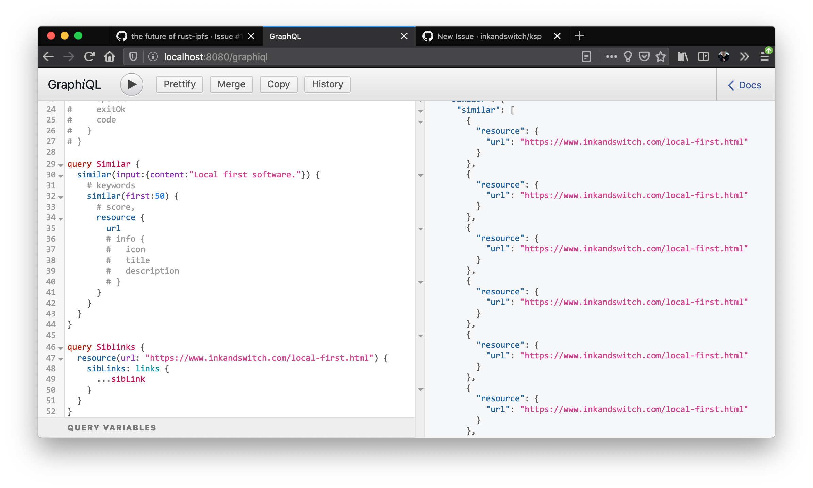
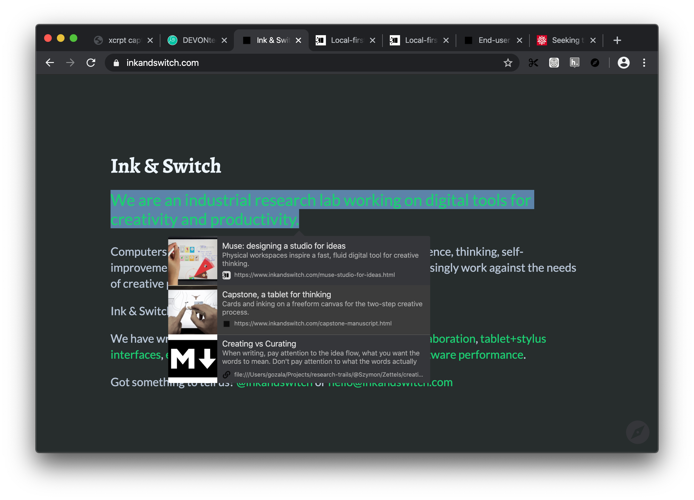
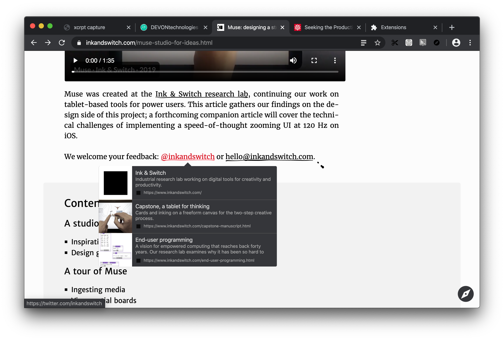

# April 27

Figured out the duplicate similarity results issue, which was occurring due to the fact that [Tantivy][] index was not replacing index entries when same resource was ingested multiple times.

Addressed the issue by deleting existing documents from the index that match URL of the content being ingested ([ `74dca7e`][])

---

Worked on alternative user interface that uses tooltips instead of sidebar for surfacing similarities and backlinks.

[Tantivy]:https://crates.io/crates/tantivy "Full text search engine library written in Rust"
[ `74dca7e`]:https://github.com/Gozala/ksp/commit/74dca7e464c6f13f4686a1ace3ccb39993cc6e76 "Delete documents for url before ingestion. Fix inkandswitch#7"

