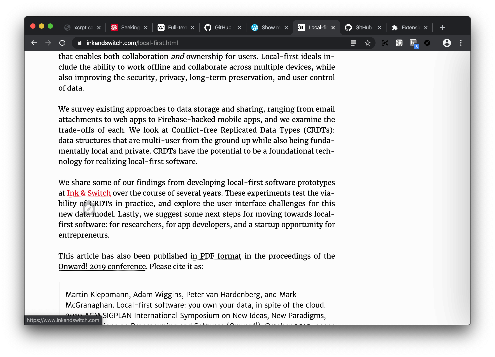
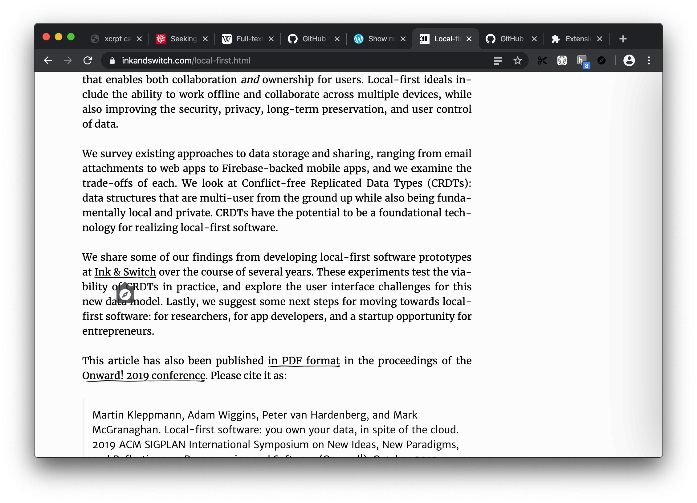
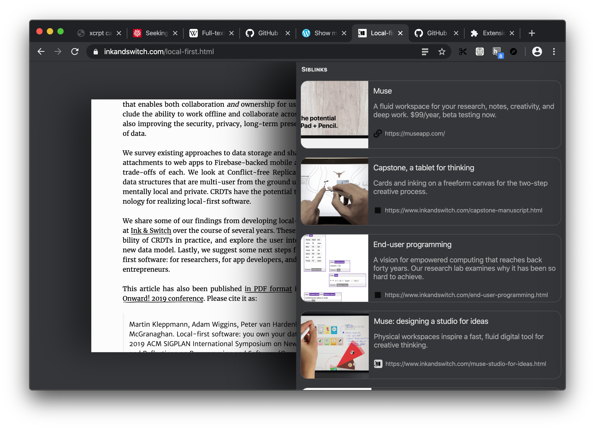
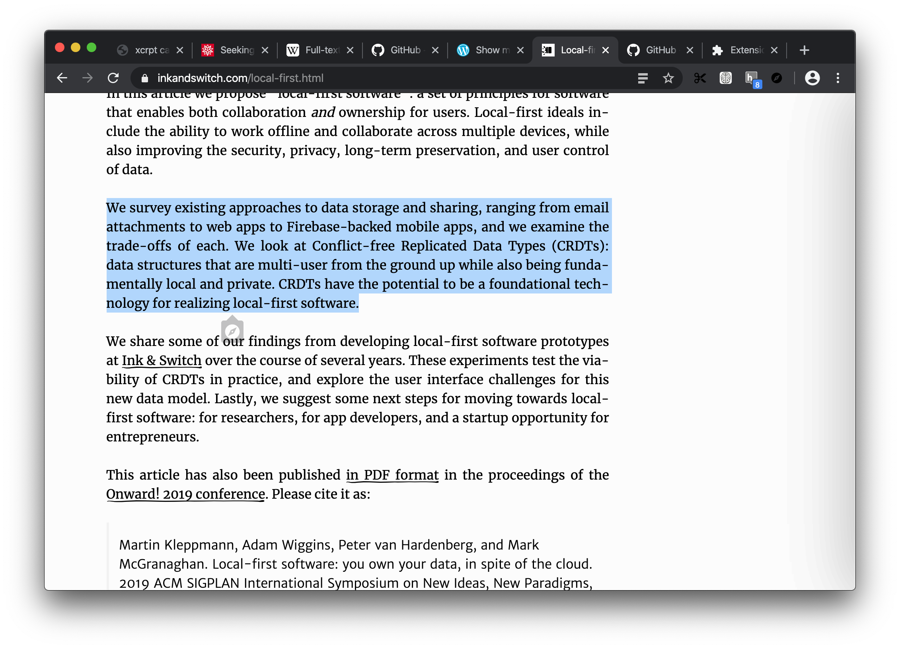
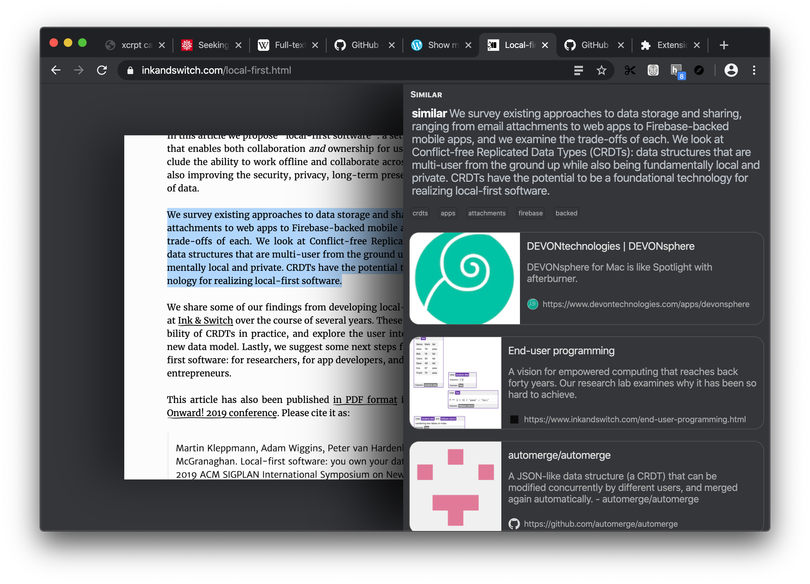
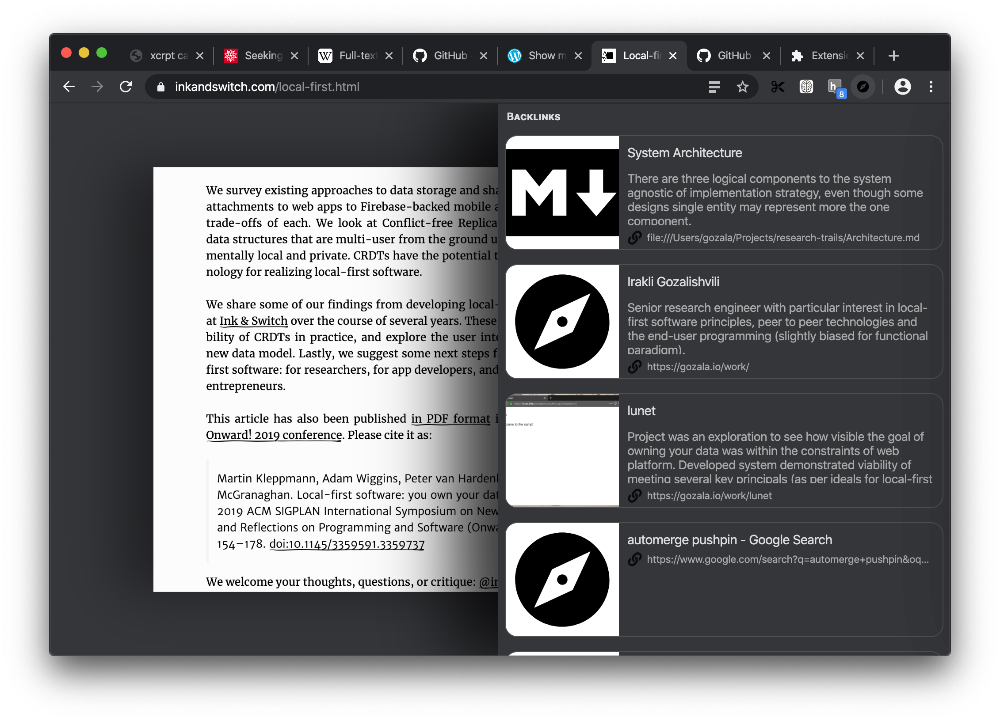

# April 28

Exploring another user interface design inspired by mouse based addition of [Mozilla ubiquity][]

<video src="https://ipfs.io/ipfs/QmcgacwEqWQhzuBNQ63tqMoCzosup9CBZELQRmdXr7LNt1?filename=Mouse-Based%20Ubiquity.mp4" controls />

Hypothesis is that main problem with sidebar based interface is that it often misinterprets user interactions like hovering links and selecting text as prompts to provide more context, but in our experience that is often not the case. In this iteration we want to explore adding a subtle UI distinct from  the hovered links that if engaged than we provide additional context.

----

In this iteration hovering links on the page reveals subtle badge, communicating that there is an extra context available (siblinks), clicking badge (unlike just hovering a link or selecting text) sends a clear signal of intention.

Hovering link reveals subtle badge

Hovering badge makes it more visible

I have recreate [Perspective UI][] interaction model from browser.html, which pushed browser chrome into the third dimension. I think it fits with the mental model of added x-ray layer.

Click a badge reveals x-ray layer

This interaction model works same for **"simlinks"** (links to similar resources), badge is added below selection that could be engaged to reveal x-ray layer. 

Selection reveals subtle badge

Click a badge reveals simlinks

In this iteration I removed thumb (which used to be in the bottom right corner) for accessing backlinks, it no longer fit new interaction model. Instead browser toolbar button can be engaged to toggle x-ray with backlinks. There is also `command+b` (`control+b` on windows) hotkey to toggle x-ray.

Toolbar button reveals backlinks

---

I really like that x-ray in the third dimension it feels satisfying and fits the over idea of zooming out to see a the bigger picture. I think there is a lot we can do to make it even better e.g. we could provide a way in x-ray view to navigate between last queries and have a way to alter them like toggle keywords or edit query input.

We could also consider keeping page below x-ray interactive so that hovering other links and such could update the x-ray view without zooming in and out.

I also find that badges work fairly well as they are not distracting (easy to ignore) and also easy enough to engage.

On the flip side I do not like added friction of click to see x-ray, intentional interaction means you are not just discovering things as you browse things you have to actively pursue discoveries which I suspect will greatly reduce the utility. I think we should explore some hybrid model between tooltip-ui concept and perspective-ui concept.

[Mozilla ubiquity]:https://en.wikipedia.org/wiki/Ubiquity_(Firefox) "Radically different type of interface to the Web - a task-centric, natural-language-based command line"
[Perspective UI]:https://gozala.io/work/perspective-ui "Exploring a new dimension of the web"

