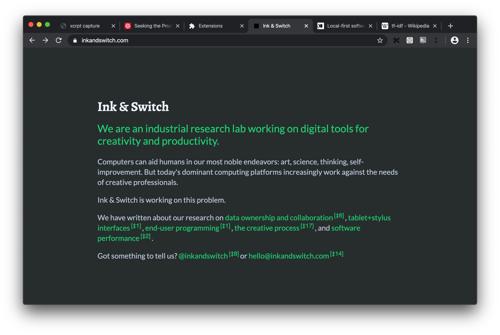

# April 29

Discussed next steps with @pvh ([inkandswitch/ksp-browser#39][]).Focusing on small improvements on the of the Perspective UI concept:

- Replacing compass icon in favor of [double dagger][] `‡` and number of connections it holds.

  > A **double dagger** or **diesis** (‡) is a typographical symbol that usually marks a third footnote after the asterisk(*) and dagger(†).

- Change position of the badge so it is displayed right after hovered link / selected text.

Badge on the right of the link showing ‡8 backlinks

Badge on the right of selection showing ‡5 simlinks

---

Investigating alternative design that adds inline, always visible  `‡3` superscripts next to the links (that have siblinks) as alternative for on-hover badges. That should provide more prominent signal that there is something there without needing to hover the link.

Spend quite a bit time attempting to do avoid DOM reflows by using absolute positioning.

 However I had give up on the attempt. Positioning the footnotes to the right of the link often overlays text that follows. Attempts to place it on top right of the link seemed more promising but was impossible to get right even across small sample of pages. 

Next version just inserts footnotes after the links, which causes visible reflow after the page is fully loaded and all the siblinks have being identified. That is not ideal, but on the other hand results look reasonable across sites

Clicking `‡3`  reveals x-ray layer as it did before.

**Note:** It is worth considering the fact that typical footnotes use numbers as a document wide identifier for the footnote. We one the other hand use that to signal number of siblinks which is neither unique per document and has different meaning that may conflict with an expectations. 

---

I think there are two alternative routes we could explore from here:

1. Continue work on badges, so that hovering it expands it into a larger tooltip for quick insight that does not require click and bringing an x-ray layer.
2. Continue work on inline double daggers, so that hovering it can bring up a tooltip with more insights.

[inkandswitch/ksp-browser#39]:https://github.com/inkandswitch/ksp-browser/issues/39 "Next iteration on UI"
[double dagger]:https://en.wikipedia.org/wiki/Dagger_(typography) "Typographical symbol that usually marks a third footnote after the asterisk(*) and dagger(†)"

