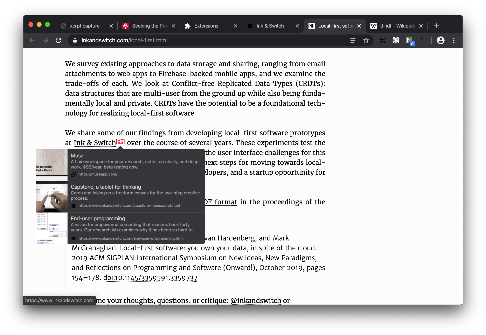
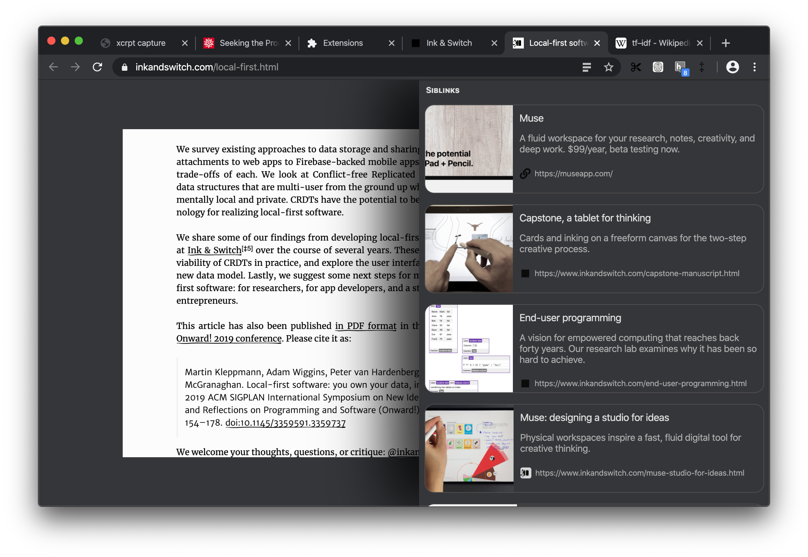

# April 30

Decided to start enhancing inline double-dagger experience first by surfacing siblinks tooltip on hover (mostly because most building blocks are already in place just need to wire them up).

Hovering ‡ shows tooltip with top 3 siblinks

Clicking the ‡ brings expands it further

Now page stays interactive even the x-ray view so you can scroll through the page. If you hover another `‡` it will even update content on the sidebar to reflect that.

<video src="./xray-siblinks.mov" autoplay loop muted playsinline></video>

