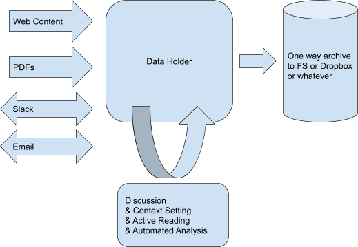

# System Architecture

There are three logical components to the system agnostic of implementation strategy, even though some designs single entity may represent more the one component.

#### Storage Interface

An interface for storing, organization and retrieval of artifacts. Actual storage can be represented via  local filesystem, database in the cloud,  existing provider (e.g. Dropbox) or whatever else. 

#### User Interface

Visual interface for the research trails. Interface for taking notes, setting context (annotations, linking) and synthesizing finding.

#### Input Interfaces

Components that add information to the storage. E.g. browser extension that captures page content, slack bot that harvest discussion, CLI / WebUI for upload pdf files.

## Implementation Strategies

Visual **user interface** is going to be implemented as an HTML + JS application. It may be deployed on in the cloud, served over localhost or be part of the browser extension but either way it would mostly be a view for underlying storage interface. Application will also represent an **input interface** for adding certain type of data.

### Localhost

This option provides **storage interface** via HTTP REST API through a local application. Application uses native filesystem as storage layer. Data syncing / sharing is deliberately left out of scope, with an assumption that existing tools (e.g. dropbox, google drive, git) can fill that gap.

This options does not restrict **user interface** and **input interface** implementation strategies as long as they can interact with provided REST API.

#### Pros

- All artifacts are [local-first][], can be access regardless of network conditions.
- No need to deal with logins, invites etc...
- Can iterate quickly, has not outside dependencies.
- There is lot of information to be harvested from local hard drive (think spotlight). Design around local  would provide incentive to harvest data well beyond cloud services.
  - Local app can be an email client as well and harvest your inbox.
  - Access to address-book (more context to your research).

#### Cons

- Sharing this work has some challenges. (install nodejs & run this script is not ideal. Maybe [pkg][] can address this. We could also consider implementing this in Rust instead that would produce single binary)
- Interface will need to carefully organize data to avoid conflicts.
- Some input interfaces like slack bot won't be able to take to localhost and will need a different way to incorporate data.

### Cloud

This option provides **storage interface** via HTTP REST API to server that we deploy in the cloud. For storage it could use whatever data store. It may also provide a way to export data (e.g. dropbox sync, git) or even use that as an underlaying storage.

#### Pros

- Sharing our work is as easy as sharing URL.
- Can be used to bridge with other cloud services e.g. (slack bot, dropbox sync, etc..)
- Collaboration is easy when everything is centralized.
- Can access user interface from my phone.

#### Cons

- Not a [local-first][], will not work without a network.
- Needs some work to avoid becoming a block hole.
- Has no access to anything not already in the cloud.

### Dropbox API

This option would provide **storage interface** by wrapping around Dropbox API (could be iCloud, Google Drive, Github, ...) that both **user interface** and **input interfaces** would use to store / retrieve information. 

#### Pros

- No need to install anything (assuming you already have dropbox).
- Can focus efforts on **user interface** and **input interfaces**.

#### Cons

- Inherits all the constraints of **Dropbox API**.

- Need to carefully organize data to avoid conflicts.

   

### Beaker App

This option would provide use **storage interface** through a [`DatArhive`][] API and will take care of synchronization with filesystem and collaborators.

#### Pros

- No need to deal with storage or sync as beaker takes care of it.
- Provides sync with local filesystem (when enabled).
- Can leverage https://hashbase.io/ to overcome p2p challenges.

#### Cons

- [Major update][beaker-rewrite] is on its way.
- Some input interfaces might require extra effort (e.g. browser extension needs a way to save captured content).

[local-first]:https://www.inkandswitch.com/local-first.html
[service worker]:https://developer.mozilla.org/en-US/docs/Web/API/Service_Worker_API/Using_Service_Workers
[`DatArchive`]:https://beakerbrowser.com/docs/apis/dat.html
[beaker-rewrite]:https://twitter.com/pfrazee/status/1233073623138738176